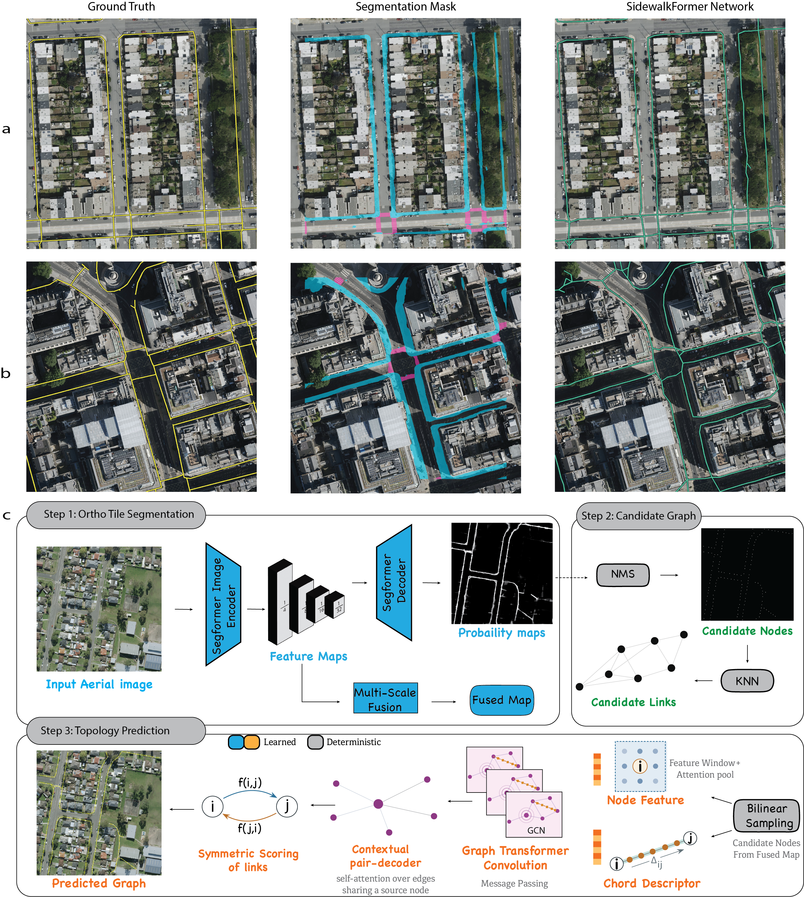

# SidewalkFormer

**Extracting connected pedestrian networks (sidewalks and crossings) from aerial imagery.**

[](LICENSE)


SidewalkFormer reconstructs pedestrian networks — sidewalks, crossings and connecting paths — from high-resolution aerial imagery. It jointly predicts semantic segmentation and graph topology, so the output is a connected, routable graph rather than a mask: each edge carries its confidence, type (sidewalk or crossing), and whether it bridges a tile seam. Per-tile graphs are stitched into continuous metropolitan-scale networks.

> **Status:** code release. The dataset will be released soon (see the
> [Roadmap](#roadmap)).

---

## Contents

- [How it works](#how-it-works)
- [Repository structure](#repository-structure)
- [Installation](#installation)
- [Pretrained weights](#pretrained-weights)
- [Quick start: map a city](#quick-start-map-a-city)
- [Training](#training)
- [Validation](#validation)
- [Evaluation](#evaluation)
- [Model variants and configs](#model-variants-and-configs)
- [Outputs](#outputs)
- [Tests](#tests)
- [Roadmap](#roadmap)
- [Citation](#citation)
- [License and acknowledgements](#license-and-acknowledgements)

---

## How it works



The paper configuration ([`config/sidewalkformer.yaml`](config/sidewalkformer.yaml)) uses:

- **Backbone:** SegFormer-B5 on native 1024 × 1024 patches. The last two
  encoder scales are fused into a 512-channel feature map at quarter
  resolution (`IMAGE_EMB_MODE: fuse2_4`).
- **Node proposals:** during training, reference-graph vertices with Gaussian
  jitter (σ = 5 px); at inference, peaks of the predicted sidewalk/crossing
  masks after non-maximum suppression.
- **Topology head:** a 4-layer, 4-head TransformerConv GNN with a pair decoder
  that scores candidate edges. It uses image features around nodes, relative
  displacement, and visual features sampled along each edge.
- **Losses:** weighted cross-entropy + 0.5 × Dice for segmentation; edge BCE
  (positive weight 2, extra weight 3 on reference bridge edges); and a
  path-connectivity term (weight 0.1).
- **City-scale inference:** overlapping patches are averaged, and pixel graphs
  are georeferenced and stitched across tile seams. Every edge keeps its
  confidence, sidewalk/crossing type, and whether it is a synthetic seam bridge.

## Repository structure

```text
SidewalkFormer/
├── train.py                    # Train SidewalkFormer or a baseline variant
├── validate.py                 # Evaluate a checkpoint on the held-out split
├── infer_city.py               # City-scale inference, stitching and GeoJSON export
├── infer_city_fast.py          # Throughput-optimised city-scale runner (same outputs)
├── infer_single.py             # Single-tile inference for inspection/debugging
├── sidewalkformer/             # Core library
│   ├── model.py                #   SidewalkFormer and the integrated baseline variants
│   ├── dataset.py              #   Dataset, patch grids, graph-label generation
│   ├── graph_extraction.py     #   Node proposals from predicted masks
│   ├── graph_utils.py          #   Reference-graph conversion and labelling helpers
│   ├── tile2net_postprocess.py #   Mask → polygon → centreline graph (Tile2Net)
│   └── utils.py                #   Config loading
├── tools/
│   ├── build_manifest.py       # Build an inference manifest from tiles + bboxes
│   └── mask_to_network.py      # Convert any binary sidewalk mask into a network
├── config/                     # Paper config + baselines
├── evaluation/                 # Tile preparation, precision/recall/F1, APLS, K-APLS
├── docs/                       # Inference guide, model variants
├── figures/                    # Paper overview figure used in this README
├── tests/                      # Unit and contract tests (no data needed)
└── third_party/                # Vendored SAM-Road and Tile2Net (original licenses)
```

## Installation

Tested with Python 3.10.

```bash
git clone https://github.com/<your-username>/SidewalkFormer.git
cd SidewalkFormer
conda env create -f environment.yml
conda activate sidewalkformer
```

The pinned versions in `requirements.txt` match the validated environment. If
the default PyTorch wheel does not match your CUDA/CPU setup, install the right
PyTorch build first. A CUDA GPU is recommended for training and city-scale
inference. Inference falls back to CPU when no GPU is available. On Apple
Silicon, training needs `PYTORCH_ENABLE_MPS_FALLBACK=1` because one operator
(`grid_sampler_2d_backward`) is not implemented on MPS.

The APLS metric is written in Go. It is only needed for evaluation
(Go ≥ 1.18):

```bash
cd evaluation/cityscale_metrics/apls && go build -o apls . && cd -
```

## Pretrained weights

Checkpoints are not stored in Git. Download the trained SidewalkFormer
checkpoint and place it under the ignored `weights/` directory:

| Model | Config | Download |
|---|---|---|
| SidewalkFormer (paper) | `config/sidewalkformer.yaml` | **TODO: add link** → `weights/sidewalkformer.ckpt` |

The SegFormer-B5 backbone used to build the model is downloaded automatically
from Hugging Face (`model_name` in the config) the first time a model is
created. Baselines additionally need:

| Variant | Required asset |
|---|---|
| SAM-Road / SAM-topology | `weights/sam_vit_b_01ec64.pth` |
| Tile2Net-topology 512 | `weights/satellite_2021_.pth` (optional pretrained Tile2Net) |
| Tile2Net-topology 1024 | `weights/hrnetv2_w48_imagenet_pretrained.pth` |

## Quick start: map a city

**0. Download the checkpoint** (see [Pretrained weights](#pretrained-weights)).

**1. Describe your tiles with a manifest.** Each record holds a tile ID, an
image path, and a WGS84 bbox `[west, south, east, north]`. If you have a folder
of tiles and a list of `[south, west, north, east]` boxes in download order,
generate the manifest with:

```bash
python tools/build_manifest.py \
  --bbox_list /path/to/bounds.json \
  --image_dir /path/to/images \
  --output /path/to/manifest.json \
  --strict
```

**2. Run inference.**

```bash
python infer_city.py \
  --config config/sidewalkformer.yaml \
  --checkpoint weights/sidewalkformer.ckpt \
  --manifest /path/to/manifest.json \
  --output_dir /path/to/results
```

**3. Open the result.** `results/global/graph_merged_edges.geojson` loads
directly in QGIS, kepler.gl or GeoPandas.

For very large areas (tens of thousands of tiles), use `infer_city_fast.py`
with the same arguments plus throughput options. Runs are resumable: rerun the
same command to continue. See the [inference guide](docs/INFERENCE.md) for
merge controls, the fast runner, and single-tile debugging.

To turn an existing binary sidewalk mask (from any source) into a network
without the model, use `tools/mask_to_network.py`
(see [docs/INFERENCE.md](docs/INFERENCE.md#from-a-mask-to-a-network-no-model)).

## Training

Prepare a dataset of RGB tiles, single-channel class masks, and pickled
pixel-space adjacency graphs. The exact directory layout depends on
`dataset_location` in the config; see `_default_dataset_root` and
`_list_dataset_tile_ids` in `sidewalkformer/dataset.py` for the supported
layouts.

```bash
python train.py \
  --config config/sidewalkformer.yaml \
  --dataset-root /path/to/Full_Combined_Dataset \
  --output-dir runs \
  --wandb-mode disabled
```

- `--dataset-root` overrides `DATASET_ROOT` without editing the YAML.
- `--wandb-mode offline|online` enables Weights & Biases logging.
- `--n_runs N --base_seed S` trains several seeds in sequence.
- `--resume path/to/last.ckpt` continues a run. `--fast_dev_run` runs a single
  batch as a smoke test.

Checkpoints and logs are written to `runs/<config name>-seed<seed>/`.

## Validation

```bash
python validate.py \
  --config config/sidewalkformer.yaml \
  --checkpoint weights/sidewalkformer.ckpt \
  --dataset-root /path/to/Full_Combined_Dataset
```

Reports segmentation IoU per class and edge (topology) metrics on the
held-out split. `--seed` (default 42) fixes the random node sampling of the
validation graphs, so repeated runs give identical numbers.

## Evaluation

The evaluation pipeline compares predicted networks with a reference network
(for example, OpenStreetMap sidewalks) tile by tile:

```bash
# 1. Convert predictions, baselines and ground truth into aligned per-tile graphs
python evaluation/prepare_tile_pkls.py --help
# 2. Compute precision / recall / F1 and APLS
python evaluation/evaluate_cityscale_metrics.py --help
```

APLS needs the Go binary built during [installation](#installation); pass
`--no_apls` to skip it. `evaluation/cityscale_metrics/apls/` also provides
**K-APLS + geometry**, which extends APLS with multiple diverse routes and a
Hausdorff/Fréchet geometry score. See [evaluation/README.md](evaluation/README.md)
and the [APLS README](evaluation/cityscale_metrics/apls/README.md).

## Model variants and configs

Select a variant with `MODEL_TYPE` in the config. Configs are grouped by
purpose:

| Folder | What's inside |
|---|---|
| [`config/`](config/) | **Paper model** — `sidewalkformer.yaml` |
| [`config/baselines/`](config/baselines/) | SAM-Road, SAM + SidewalkFormer topology, SegFormer + Tile2Net post-processing, Tile2Net + SidewalkFormer topology |

[docs/MODEL_VARIANTS.md](docs/MODEL_VARIANTS.md) maps every variant to its
backbone, graph method, and weights.

## Outputs

`infer_city.py` writes:

```text
results/
├── tiles/<tile_id>/
│   ├── graph_core.npz        # nodes, edges, edge scores, link types, synthetic flags
│   ├── graph_core.p          # pixel adjacency dict (Sat2Graph format)
│   ├── pred_mask_core.npy    # predicted class mask
│   ├── walkmask_core.png
│   ├── graph_viz.png
│   └── meta.json
├── global/
│   ├── graph_merged.npz
│   ├── graph_merged.geojson        # nodes + edges
│   ├── graph_merged_edges.geojson  # LineStrings: link_type, confidence, synthetic
│   └── graph_merged_nodes.geojson
└── resume_state.json
```

`edge_types`: `0` = sidewalk, `1` = crossing. Synthetic seam-bridge edges have
`null` confidence and `synthetic = true`.

## Tests

The tests create their own temporary fixtures. No imagery, dataset or
checkpoint is needed.

```bash
python -m unittest discover -s tests
python -m unittest discover -s evaluation/cityscale_metrics/apls -p "test_*.py"
```

## Roadmap

- [ ] **Dataset** — the annotated dataset will be released soon.
- [ ] **Demo** — a small no-setup demo.
- [ ] **Packaging** — `pip`-installable package.
- [ ] **Human-in-the-loop learning** — incorporating human corrections into
      training.

## Citation

The paper is not public yet. Citation details will be added here when it is
published. Until then, please cite this repository.

## License and acknowledgements

SidewalkFormer code is released under the [MIT License](LICENSE).

This project builds on excellent open-source work, vendored under
`third_party/` with the original licenses kept:

- [SAM-Road](https://arxiv.org/abs/2403.16051) (MIT) and
  [Segment Anything](https://github.com/facebookresearch/segment-anything)
  (Apache 2.0)
- [Tile2Net](https://github.com/VIDA-NYU/tile2net) (BSD 3-Clause), including
  NVIDIA-derived segmentation code
- [SegFormer](https://huggingface.co/docs/transformers/model_doc/segformer)
  via Hugging Face Transformers

See [THIRD_PARTY_NOTICES.md](THIRD_PARTY_NOTICES.md) for details. Datasets and
model weights from third parties are subject to their own terms.
